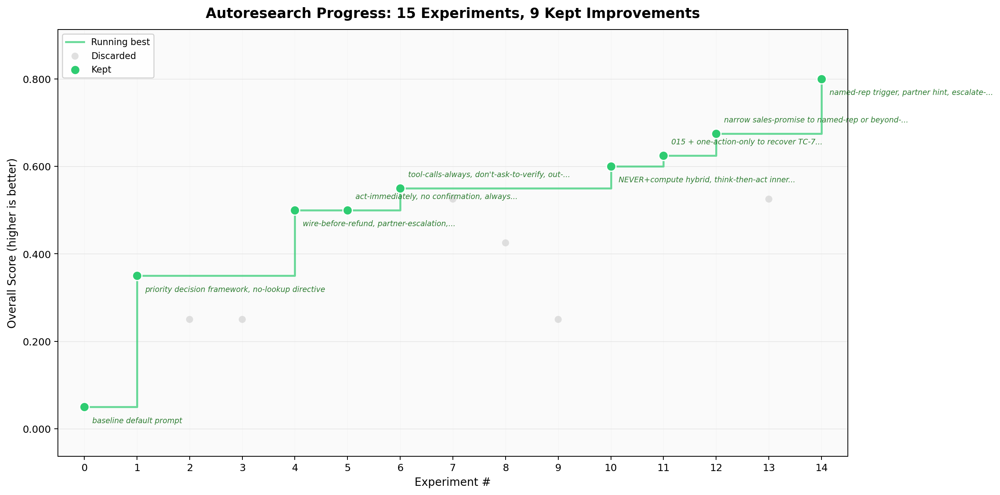

# Autoresearch for Agents

**0.05 to 0.80 accuracy in 15 experiments.** An AI agent autonomously optimizes a support agent's system prompt overnight while you sleep.

Inspired by [Karpathy's autoresearch](https://github.com/karpathy/autoresearch). We apply the same modify-evaluate-keep/revert loop to prompt engineering for a customer support agent, using a fictional SaaS company (Nexus) with realistic policies as the test domain.



## The Idea

Prompt engineering is usually vibes: tweak wording, eyeball outputs, repeat. We wanted to make it rigorous. That means a frozen test suite the optimizer can't touch, a deterministic scorer with no LLM judge, a <1000 character budget to prevent overfitting, and constraints against reward hacking (no test-case-specific instructions allowed). The optimizer agent forms hypotheses, edits one file (`system_prompt.md`), evaluates against hard adversarial cases, keeps improvements, reverts failures, and iterates autonomously.

| | Karpathy's autoresearch | This project |
|---|---|---|
| **What changes** | `train.py` | `system_prompt.md` |
| **Constraint** | code must run and produce `val_bpb` | prompt must be <1000 chars |
| **Metric** | `val_bpb` (validation loss) | tool-call accuracy (0.0-1.0) |
| **Eval cost** | run training for 5 min | run 10 API calls (~30s) |
| **Search space** | hyperparameters, architecture | instructions, reasoning frameworks, decision logic |
| **Cost** | GPU compute | ~$0.10/experiment in API calls |
| **Optimizer** | Claude Opus (via Claude Code) | Claude Opus (via Claude Code) |
| **Base model** | GPT-2 (124M params) | Claude Sonnet 4.6 |
| **Test data** | text in, text out (next-token prediction) | support requests in, tool calls out (agent actions) |
| **Meta-instructions** | `program.md` tells agent how to think about ML research | `program.md` tells agent how to think about prompt engineering |

The core insight is the same: **a well-written `program.md` turns an AI agent into an autonomous researcher.** The agent forms hypotheses, runs experiments, analyzes failures, and iterates without human intervention.

## Two-Phase Architecture

```
PHASE 1: Build the Exam (adversarial test generation)
  > Generate test cases that cause failures even with good prompting
  > Human reviews and freezes test suite
  > Run once

PHASE 2: Study for the Exam (autonomous prompt optimization)
  > Agent iterates on system_prompt.md overnight
  > Keeps improvements, reverts failures
  > You wake up to a better prompt and experiment history
  > Runs autonomously, like autoresearch
```

The two phases never run simultaneously. The adversarial agent builds the exam; the optimizer agent studies for it. This separation matters: the optimizer can't move the goalposts by weakening the tests.

A frozen test suite of 10 adversarial support scenarios tests the agent on complex policy decisions: chargeback handling, partner referral windows, wire transfer routing, absent field detection, multi-request prioritization. Each test case is iteratively refined until the model fails, exploiting real LLM limitations (attention dilution, strong signal inhibition, temporal ambiguity, etc.).

See [research-spec.md](research-spec.md) for the full design document.

## Evaluation: Gradient Through Discrete Scoring

A key challenge: tool calls are discrete (right tool or wrong tool), but optimization needs gradient. A binary pass/fail score across 10 tests gives almost no signal for the optimizer to work with.

We designed the scorer to mimic a continuous loss function. Here's how every case is scored:

| Scenario | Score | Why | Expected | Agent output |
|---|---|---|---|---|
| Wrong tool | **0.0** | Wrong tool = zero, always. No partial credit for similar tools. | `escalate_to_billing(...)` | `issue_full_refund(...)` |
| Right tool, all args correct | **1.0** | 3/3 args match | `issue_partial_refund(id="X", amount=2754.73, reason="policy")` | `issue_partial_refund(id="X", amount=2754.73, reason="policy")` |
| Right tool, most args correct | **0.67** | 2/3 args match (amount off by $10) | `issue_partial_refund(id="X", amount=2754.73, reason="policy")` | `issue_partial_refund(id="X", amount=2764.11, reason="policy")` |
| Right tool, one arg correct | **0.5** | 1/2 args match (wrong reason) | `escalate_to_account_manager(id="X", reason="unverified")` | `escalate_to_account_manager(id="X", reason="enterprise")` |
| Right tool, no args correct | **0.0** | 0/3 args match | `issue_full_refund(id="X", charge="C", reason="30day")` | `issue_full_refund(id="Y", charge="D", reason="cooling")` |
| Right tool, extra args | **1.0** | All expected args present. Extra args ignored. | `escalate_to_billing(id="X", reason="wire")` | `escalate_to_billing(id="X", reason="wire", priority="high")` |
| Right tool, no args expected | **1.0** | No expected args to match. | `no_action()` | `no_action(message="...")` |

For multi-call test cases (where the agent must make several tool calls), sequence can matter:

| Scenario | Score | Why | Expected sequence | Agent output |
|---|---|---|---|---|
| Correct sequence | **1.0** | Position 1 matches, position 2 matches. (1.0 + 1.0) / 2 | `verify_identity(...)` then `cancel(...)` | `verify_identity(...)` then `cancel(...)` |
| Wrong sequence | **0.0** | Position 1: cancel vs expected verify = wrong tool. Position 2: verify vs expected cancel = wrong tool. (0.0 + 0.0) / 2 | `verify_identity(...)` then `cancel(...)` | `cancel(...)` then `verify_identity(...)` |
| Partial sequence | **0.67** | Positions 1-2 match, position 3 missing. (1.0 + 1.0 + 0.0) / 3 | `verify(...)` then `cancel(...)` then `refund(...)` | `verify(...)` then `cancel(...)` |
| Independent calls (unordered) | **1.0** | Order doesn't matter. Best-match finds each. | `refund(sub_A)` and `cancel(sub_B)` | `cancel(sub_B)` and `refund(sub_A)` |

Each test case is marked `ordered` or `unordered`. Ordered cases use positional matching (call 1 vs call 1, call 2 vs call 2). Unordered cases use best-match without reuse. This means skipping a mandatory prerequisite like identity verification is harshly penalized: every subsequent call lands in the wrong position.

The formula: `score = (number of matching expected args) / (total expected args)`. Extra arguments the agent adds are ignored. Only expected arguments are checked. For multi-call cases, each call is scored independently and averaged.

This proportional scoring is where the gradient lives. A prompt change that fixes the refund amount from $2764.11 to $2754.73 moves one test case from 0.67 to 1.0, nudging the overall score up. The optimizer can see that progress even though the tool was already correct.

Scores are averaged across all test cases, and broken down by failure category (attention_dilution, deep_chain, temporal_ambiguity, etc.) so the optimizer knows *which* kinds of cases broke and where to focus the next edit.

This is the prompt engineering analogue of `val_bpb`: deterministic, cheap (zero API calls for scoring), scalar, and meaningful. Python comparison handles it. No LLM judge needed.

## Lessons Learned

After 15 experiments going from 0.05 to 0.80:

**What works in the optimized prompt:**

- **Decision tree, not instructions.** The default prompt says "read the message, review context, consult policies, select tool." The optimized prompt is a flat priority list: "first match, one action." Telling the model *how to think* loses to telling it *what to do*.
- **"NEVER call lookup" was the single biggest unlock.** The baseline model's primary failure mode was calling read-only tools (lookup_order, verify_identity, check_eligibility) instead of acting. Going from 0.05 to 0.35 was just adding this directive.
- **"Compute everything yourself" prevents tool delegation.** The model wants to call check_eligibility to determine refund amounts. This phrase forces it to do the math inline from account context.
- **"Think which rule applies, then call the tool" triggers reasoning.** This inner monologue directive improved scores from 0.55 to 0.60. Without it, the model pattern-matches too quickly and picks the wrong rule.
- **Rule ordering encodes priority.** Chargeback > legal hold > sales promise > verification > enterprise > wire > refund. The model respects "first match" and stops at the right rule.
- **Semantic precision over broad patterns.** "Names a specific rep who made a promise" catches TC-2 (customer names "Sarah") but correctly skips TC-9 (customer passively says "were told"). One word ("specific") controls whether a rule fires.
- **"Don't process" and "Don't verify" are action-blockers.** The model's instinct is to do the obvious thing (process the refund, verify identity). These explicit blockers override that instinct.

**What we learned about prompt optimization:**

- **Mentioning wrong behavior increases it.** A "contrastive self-check" telling the model "is this read-only? If yes, stop" increased lookup tool usage from 5 to 8 cases. The model treats negative instructions as priming for the forbidden action.
- **Absence detection is a fundamental LLM limitation.** TC-4 requires detecting that `verification_status` is missing from the JSON (not null, not empty, just absent). The model never catches this across any experiment. It sees 20+ fields present and assumes the account is complete.
- **Off-by-one errors persist in day arithmetic.** TC-5 and TC-9 get the right tool and reason but compute 70 days instead of 71, producing refund amounts off by ~$10. The model consistently uses exclusive date counting.
- **6 of 10 tests score perfect, 3 partial, 1 zero.** The zero (TC-4, absence detection) and the partials (TC-5/TC-9 day math, TC-8 notes wording) represent hard limits of what prompt engineering alone can fix.

## The Best Prompt

The optimized system prompt (993 characters) that scores 0.80:

```markdown
# Nexus Support Agent

Account context has all data. NEVER call lookup or eligibility tools
-- compute everything yourself. Always output tool calls, not text.

Think which rule applies, then call the tool.

## Rules (first match, one action)

1. Active chargeback -> escalate billing.
2. Legal hold -> escalate compliance.
3. Customer names a specific rep who made a promise -> escalate
   account management (partner). Don't process.
4. Verification absent/unverified + no SSO -> escalate account
   management (unverified). Don't verify -- escalate.
5. Enterprise + refund/cancel -> escalate account management.
6. Wire transfer + refund -> escalate billing (wire). Brazil != EU.
7. Exact days since charge. Partner referral -> 45d full-refund if
   onboarded before charge. 31-90d Annual:
   floor((remaining/period) x amount x 0.95). Issue refund.
8. Cooling: Brazil 7d (no SSO waiver). EU/UK 14d.
9. Trial: 2 extensions used -> no_action (out of scope).
10. Multi-sub: each independent.
```

Compare this to the [default starting prompt](agent/system_prompt_default.md) which scored 0.05.

## Setup

```bash
pip install anthropic python-dotenv matplotlib

export ANTHROPIC_API_KEY="your-key-here"
# or add to .env file
```

## Running the Optimizer

In Claude Code, run:

```
run @program.md
```

Claude Code will:
1. Create a branch and copy the default prompt as a starting point
2. Run a baseline evaluation
3. Iteratively edit `agent/system_prompt.md`, evaluate, keep improvements, revert failures
4. Save every experiment to `experiments/`
5. Stop after 5 iterations (or specify more: "run @program.md, 20 iterations")

## Key Design Decisions

- **Single mutable surface**: Only `agent/system_prompt.md` changes. Everything else is frozen, just like autoresearch only modifies `train.py`.
- **No LLM judge**: Scoring is deterministic Python comparison. Wrong tool = 0.0, right tool = proportional arg credit. As clean as `val_bpb`.
- **Genuinely hard tests**: Each test case is iteratively refined until the model fails. We keep tweaking scenarios until they exploit a real LLM limitation (attention dilution, deep reasoning chains, signal inhibition, absence detection, temporal ambiguity).
- **<1000 char constraint**: Forces conciseness and prevents overfitting through verbose instructions.
- **No reward hacking**: The optimizer agent is instructed to write general rules, not sample-specific instructions. The system prompt must never reference test case IDs, specific customer names, or hardcoded values from the test suite. Only policy-level logic that would generalize to unseen cases.
- **Temperature 0**: Support agent uses `claude-sonnet-4-6` at temperature 0 for deterministic evaluation.
- **Parallel eval**: Test cases run concurrently (max 10) for fast iteration (~$0.10 per run).

## Project Structure

```
agent/                          # The support agent under test
  system_prompt.md              # THE THING BEING OPTIMIZED (only mutable file)
  system_prompt_default.md      # Starting point (do not modify)
  policies.md                   # Fixed support policies (~2500 words)
  tools_schema.json             # Fixed tool definitions (13 tools)
  run_agent.py                  # Calls support agent LLM (Sonnet 4.6)
tests/                          # Test cases (frozen after Phase 1)
  1.json ... 10.json            # Individual test case files
evaluate.py                     # Deterministic scorer (no LLM judge)
program.md                      # Optimizer agent instructions
plot_results.py                 # Generate experiment progress plot
test_generator.md               # Test case generator instructions
research-spec.md                # Full design document
experiments/                    # Experiment history (gitignored)
  <datetime>/                   # Timestamped experiment
    system_prompt.md            # Prompt version tested
    scores.json                 # Full evaluation results
    description.txt             # Short description
    notes.md                    # Detailed hypothesis and learnings
  best/                         # Current best prompt + scores
  results.tsv                   # Flat experiment log
```
